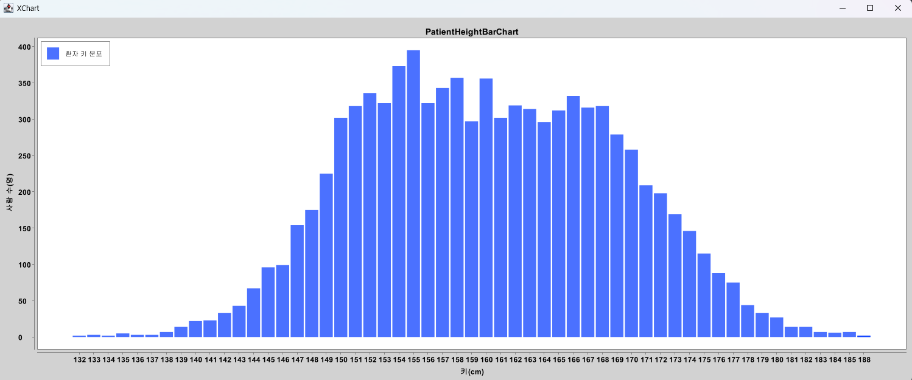
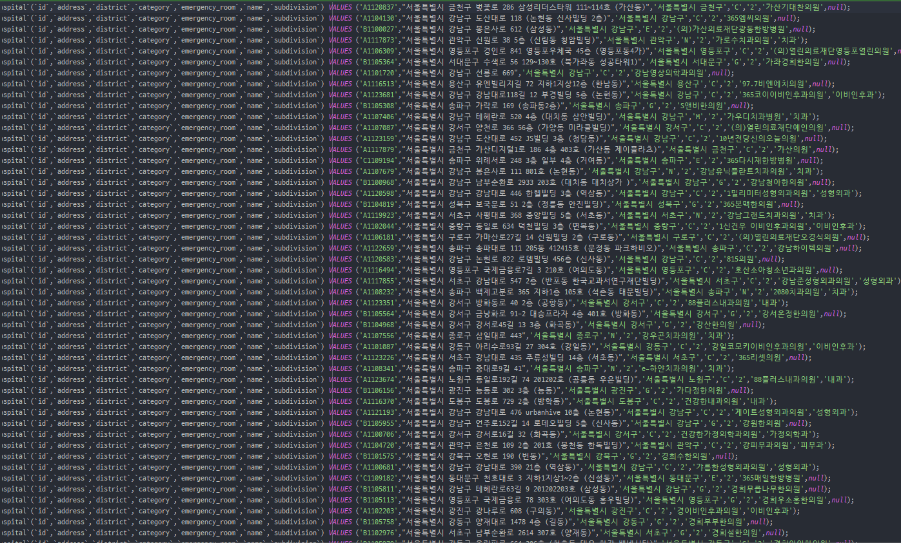

# 멋쟁이사자처럼 백엔드 스쿨 2기

## 학습 로그
|  주차  |                               수업 내용                                |     알고리즘      |   특강  |
|:----:|:------------------------------------------------------------------:|:-------------:|:-----:|
| 1주차  | Java 기초 (`자바 소개`, `변수`, `연산자`, `조건문&반복문`, `배열`, `객체지향 프로그래밍1`) |               |       |
| 2주차  |  Java 기초 (`객체지향 프로그래밍2`, `예외처리`, `java.lang 클래스` `Calendar`)   |               |       |
| 3주차  |     `Git`, Java 응용(`Collection Framework`, `입출력`, `Generics`)      | 코드업 1001~1042 |       |
| 4주차 |                             DB입문, AWS                              |               | `도메인특강` |

## 수행 프로젝트 목록
1. 콘솔 게임 만들기
   1. 가위바위보 게임
   2. Up & Down 숫자 게임
2. 대용량 파일 처리 프로젝트
   1. 환자 데이터를 이용해 키 분포 시각화
   2. 대한민국 전출입 공공데이터를 이용해 서울에서 전출간 지역 비율 시각화
### 프로젝트 결과물
#### 1. 환자 키 분포 시각화 👉 [레포지토리 이동](https://github.com/wogus0518/LikeLion-Backend/tree/main/Class/src/week3/date221007/miniProject)

#### 2. 서울 전출입 비율 시각화 👉 [레포지토리 이동](https://github.com/wogus0518/LikeLion-Backend/tree/main/Class/src/week3/date221007/miniProject)

#### 3. 공공데이터에서 필요한 정보만을 추출한 후 .sql 파일 생성 👉 [레포지토리 이동](https://github.com/wogus0518/like-lion/tree/main/src/main/java/codelion/projects/hospitalProject)

