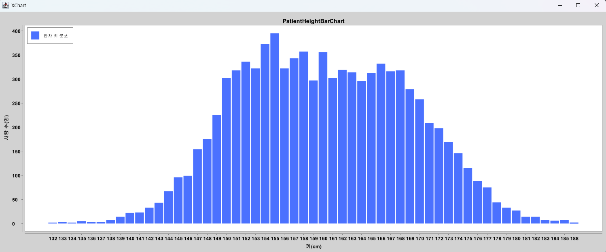
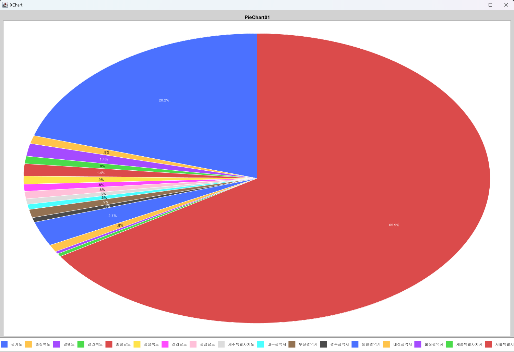

# 멋쟁이사자처럼 백엔드 스쿨 2기

## [자바 미니 프로젝트](https://github.com/wogus0518/LikeLion-Backend/tree/main/Class/src/week3/date221007/miniProject)
아래 두 가지 프로젝트를 하는데 파일을 읽는 부분과 쓰는 부분은 중복이 되므로
코드 재사용성을 높이기 위해 Context로 설계하였다.
### 환자 키 분포 시각화하기
Java의 파일 입출력을 이해하고 환자 데이터를 읽어 환자의 키 분포를 시각화 할 수 
있도록 데이터를 전처리하고 외부 라이브러리 XChart를 이용해 시각화 한다.

### 서울에서 전출 간 지역 비율 시각화하기
500MB 통계 데이터를 읽은 후 시각화에 필요한 데이터로 전처리를 하고 
XChart 라이브러리를 이용하여 파이형 차트를 그려 비율을 쉽게 알아볼 수 있게 한다.

